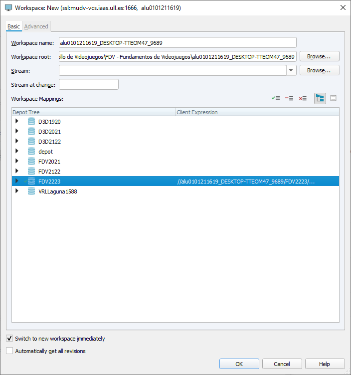
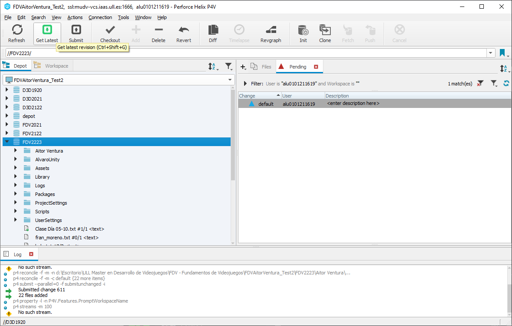
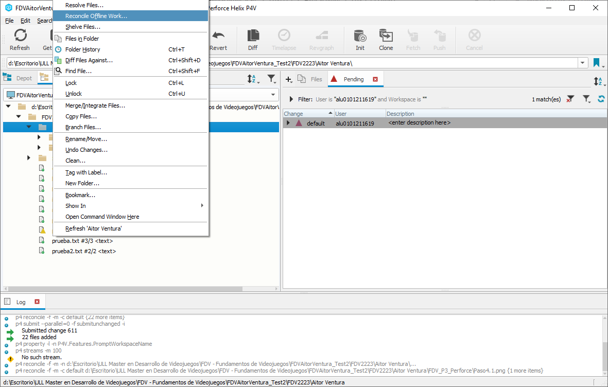
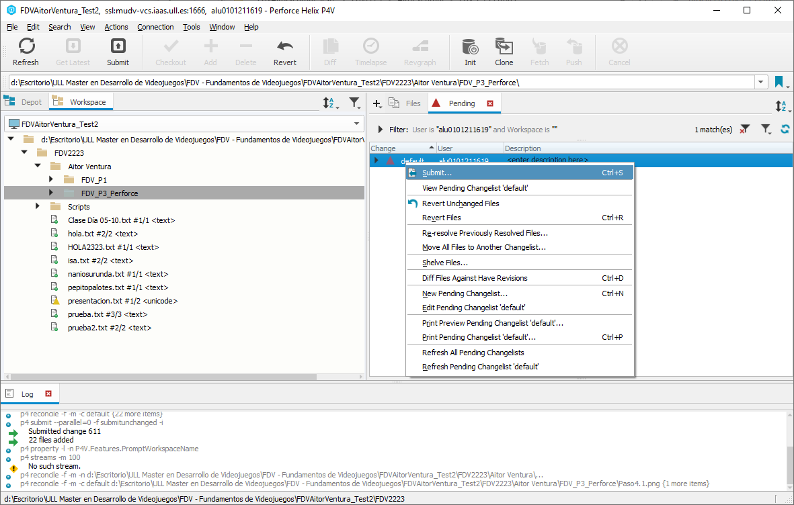

## 🎈 Uploading files to Perforce

## 🎈 Subir archivos a Perforce
El proceso siguió los siguientes puntos:
1. Acceder a la VPN de la Universidad de La Laguna siguiendo su [guía](https://docs.google.com/document/d/1xhSRVqo6y5HYtQQtBemLEwDG6a_yjGlzrxjwuYxIQAk/edit).
2. Descargar Perforce y su herramienta [P4V](https://www.perforce.com/products/helix-core).
3. Iniciar sesión en el servidor remoto de Perforce de la Universidad con la cuenta institucional y con el set de caracteres Windows-1252.
4. Crear un nuevo *workspace* que sólamente siguiera el repositorio *FDV2233* con el nombre deseado y el directorio donde se quiere inicializar la clonación.

5. Seleccionar el repositorio que se quiere clonar y darle al botón "Get Latest", consiguiendo una clonación completa.

6. En el *Workspace*, crear la carpeta específica del alumno que contendrá las diferentes prácticas.
7. Clicar en el menú de arriba a *Refresh*, seleccionar la carpeta padre anterior, elegir la opción *Reconcile offline work", y luego seleccionar *Reconcile*.

8. Con todos los cambios subidos (equivalente a *commit* en Git), ir a la pestaña *Pending*, seleccionar los cambios, y darle a "Submit" (equivalente a *push*).

¡Felicidades! Todo hecho 🤩.
